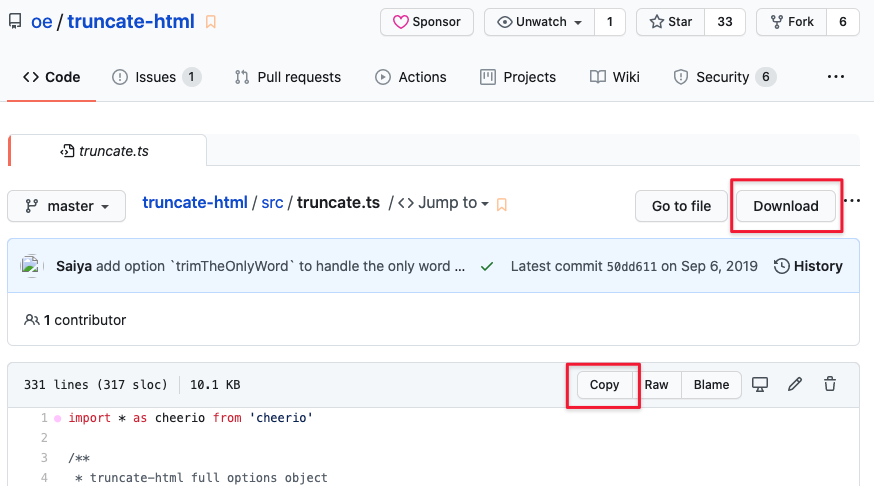

# Download Github Sub-folder User script

[中文说明](#中文说明)

> You can create your own userscript power by webpack/es6/typescript/etc by starting from this [template](https://github.com/oe/webpack-userscript-template)

If you have any issues with this script, please create an issue on [Github](https://github.com/oe/download-git-userscript/issues)

## Features
* **download github source code online**: allow you to download whole repo,  a sub-folder of a repo  or a single file online without `git clone` locally
* **copy source code content by one click**: allow you to copy source code in repo's single file view
* **seamless integration**: seamless integrated with Github, and works great with [octotree](https://github.com/ovity/octotree).

## Usage

### Install a user script manager
To use user scripts you need to first install a user script manager. Which user script manager you can use depends on which browser you use.

  * Chrome: [Tampermonkey](https://chrome.google.com/webstore/detail/tampermonkey/dhdgffkkebhmkfjojejmpbldmpobfkfo) or [Violentmonkey](https://chrome.google.com/webstore/detail/violent-monkey/jinjaccalgkegednnccohejagnlnfdag)
  * Firefox: [Greasemonkey](https://addons.mozilla.org/firefox/addon/greasemonkey/), [Tampermonkey](https://addons.mozilla.org/firefox/addon/tampermonkey/), or [Violentmonkey](https://addons.mozilla.org/firefox/addon/violentmonkey/)
  * Safari: [Tampermonkey](http://tampermonkey.net/?browser=safari) or [Userscripts](https://apps.apple.com/app/userscripts/id1463298887)
  * Microsoft Edge: [Tampermonkey](https://www.microsoft.com/store/p/tampermonkey/9nblggh5162s)
  * Opera: [Tampermonkey](https://addons.opera.com/extensions/details/tampermonkey-beta/) or [Violentmonkey](https://violentmonkey.github.io/get-it/)
  * Maxthon: [Violentmonkey](http://extension.maxthon.com/detail/index.php?view_id=1680)
  * Dolphin: [Tampermonkey](https://play.google.com/store/apps/details?id=net.tampermonkey.dolphin)
  * UC: [Tampermonkey](https://www.tampermonkey.net/?browser=ucweb&ext=dhdg)

### Install this user script

[click here to install this script](https://greasyfork.org/scripts/411834-download-github-repo-sub-folder/code/Download%20github%20repo%20sub-folder.user.js)

### Configure DownGit web app(not required)
Due to github api requests rate limit, if you use [DownGit](https://downgit.evecalm.com/) frequently, you may failed to download files with it. Then you can click ***Github Auth*** button in the center of [DownGit](https://downgit.evecalm.com/) to auth your account with this app.

### Credits
This script use [Downgit](https://downgit.evecalm.com/)([sourcecode](https://github.com/oe/DownGit/)) to download github sub-folder. DownGit is forked from [MinhasKamal](https://github.com/MinhasKamal/DownGit), I just added Github Auth feature. Thanks to [MinhasKamal](https://github.com/MinhasKamal/)

# 中文说明

无需克隆GitHub仓库, 一键在线下载 Github仓库子文件夹; 同时还能在源码详情页一键复制源码.

> 你也可以使用模版 [template](https://github.com/oe/webpack-userscript-template)使用 webpack/es6/typescript/等技术=来创建你自己的 userscript.

如果你使用中遇到任何问题, 欢迎在[Github](https://github.com/oe/download-git-userscript/issues) 上提交 issue
## 功能特性
* **在线下载Github仓库源码**: 你可以在线下载整个仓库、仓库的某个文件夹、单个文件的代码, 无需在机器上使用`git clone`命令下载完整仓库
* **一键复制源代码**: 在浏览单个文件时, 可以快速一键复制源码
* **无缝集成**: 与 GitHub 无缝集成, 看起来就像是原生功能, 与 Github 增强扩展 [octotree](https://github.com/ovity/octotree) 也能无缝配合

在线下载Github仓库的文件夹功能使用开源项目 [DownGit](https://downgit.evecalm.com/)([源码](https://github.com/oe/DownGit/)) 实现. 该项目fork自[MinhasKamal](https://github.com/MinhasKamal/DownGit), 本人增加了GitHub auth授权功能, auth 授权后, downgit则拥有更多的Github API调用频次, 即可以用于下载更多github文件.

## 使用说明

### 安装脚本管理器

Chrome 用户推荐安装浏览器扩展: [Tampermonkey](https://chrome.google.com/webstore/detail/tampermonkey/dhdgffkkebhmkfjojejmpbldmpobfkfo) 

其他选择可参考: [安装一个用户脚本管理器](https://greasyfork.org/zh-CN#home-step-1)

### 安装脚本

[点此来安装脚本](https://greasyfork.org/scripts/411834-download-github-repo-sub-folder/code/Download%20github%20repo%20sub-folder.user.js)

### DownGit 网站配置(非必须)
因为Github对第三方应用调用API频率有限制, 如果你经常使用[DownGit](https://downgit.evecalm.com/)下载文件, 则可能出现下载失败的情况. 

此时就建议你点击网站中间的 ***Github Auth*** 按钮进行 Auth 授权, 这样 DownGit 可以拥有更多api调用次数, 能下载更多的文件. 

## develop steps

### change settings of chrome

1. navigate to `chrome://flags/#allow-insecure-localhost`, enable insecure localhost
2. navigate to `chrome://extensions/?id=dhdgffkkebhmkfjojejmpbldmpobfkfo`(Chrome manage extensions page of `Tampermonkey`) and enable `Allow access to file URLs` (you need to manual reload page when dev userscript, see [#475](https://github.com/Tampermonkey/tampermonkey/issues/475#issuecomment-348594785) for more detail)

### dev

1. `yarn`
2. `yarn dev`
3. open <https://127.0.0.1/download-git-userscript.proxy.user.js> in browser(click  `Advanced` -> `proceed` if it shows a security warning ) to install the proxy script
4. dev code, reload github.com webpage after userscript changed

## references
1. [Tampermonkey docs](https://www.tampermonkey.net/documentation.php)
